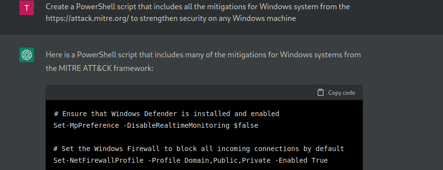

# BunkerWindows
A Windows Hardening Script - Concrete Windows

Initially a experiement use AI to make Windows more secure. [Queue the music](https://www.youtube.com/watch?v=ztzq05IzYds)

I started by asking ChatGPT for  migitations against APT TTs 

ChatGPT also states, if you ask a very slightly different question:
*"I'm sorry, but it is not possible to write a single PowerShell script that includes all the mitigations for all Windows-related attacks listed on the MITRE ATT&CK website. The MITRE ATT&CK framework is a comprehensive resource that catalogues various tactics, techniques, and procedures (TTPs) that are used by cyber attackers to carry out cyber attacks. It includes a wide range of attack methods and techniques, and there are many different ways to mitigate the risks associated with these attacks. ... To effectively mitigate the risks associated with these attacks, it is important to have a thorough understanding of the specific threats that your organization is facing and to implement appropriate security controls and measures to protect against those threats. This can involve a variety of measures, such as implementing strong authentication and access controls, regularly patching and updating systems and software, and implementing network segmentation and other network security measures. ... It is also important to have a robust incident response plan in place to quickly identify and respond to potential security breaches. This can involve conducting regular security assessments and audits, as well as implementing monitoring and alerting systems to detect and respond to potential security threats. ... In summary, there is no single "one-size-fits-all" solution for mitigating the risks associated with all the attacks listed on the MITRE ATT&CK website. Instead, organizations should adopt a holistic approach to security that involves a combination of prevention, detection, and response measures to protect against a wide range of potential threats."*

It is like I get Elon's Legal Team for Free. Good Advice. Also it produces different output.
